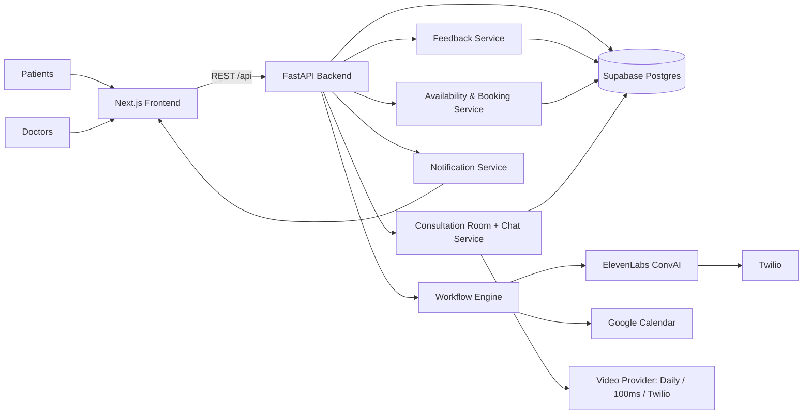

# CareSync AI

A healthcare platform that helps patients quickly find available doctors and complete consultations remotely.

## Problem Statement

Patients struggle to find available doctors quickly and access consultations remotely.

CareSync AI addresses this by combining doctor availability, appointment booking, and remote consultation into one workflow-first platform.

## Objectives

- Improve doctor-patient accessibility.
- Enable remote healthcare with chat/video consultation.

## Key Features

- Doctor listing with real-time availability and filtering.
- Appointment booking, slot reservation, reschedule, and cancellation.
- Remote consultation room (chat + video-ready provider integration).
- Notifications and booking reminders.
- Doctor feedback and rating flow.
- Workflow automation for follow-ups, calls, and patient communication.

## Expected Outcome

A platform that provides fast, remote access to healthcare services and reduces friction in connecting patients with the right doctor.

## Tech Stack

### Frontend

- Next.js 16 (App Router), React 19, TypeScript
- Tailwind CSS 4 + shadcn/ui-style component patterns
- React Flow (`@xyflow/react`) + Dagre for workflow builder graph layout
- Supabase JS client for client-side integrations

### Backend

- FastAPI + Uvicorn (Python)
- Pydantic v2 for request/response validation
- Async HTTP integrations via `httpx` and `aiohttp`

### Database & Auth

- Supabase (PostgreSQL)
- SQL migrations under `backend/migrations`
- Local role-based auth flows (doctor/patient)

### External Integrations

- ElevenLabs Conversational AI (voice call workflows)
- Twilio (telephony bridge for voice calls)
- Google Calendar API (appointment sync)
- PDF processing (`pdfplumber`, `pdfminer.six`, `pypdfium2`) for document-driven flows

## Architecture



## Monorepo Structure

- `frontend/` - Next.js web app for patients and doctors
- `backend/` - FastAPI APIs, workflow engine, integrations
- `backend/migrations/` - schema and seed SQL scripts

## Quick Start

### 1) Backend

```bash
cd backend
python -m venv .venv
source .venv/bin/activate
pip install -r requirements.txt
uvicorn main:app --reload --port 8000
```

### 2) Frontend

```bash
cd frontend
npm install
npm run dev
```

### 3) Environment

Create `backend/.env` with required service credentials:

- `SUPABASE_URL`
- `SUPABASE_SERVICE_ROLE_KEY`
- `ELEVENLABS_API_KEY`
- `ELEVENLABS_AGENT_ID`
- `ELEVENLABS_PHONE_NUMBER_ID`
- `ELEVENLABS_WEBHOOK_SECRET`
- `AUTH0_DOMAIN`, `AUTH0_CLIENT_ID`, `AUTH0_CLIENT_SECRET`
- `AUTH0_M2M_CLIENT_ID`, `AUTH0_M2M_CLIENT_SECRET`

Create `frontend/.env.local`:

- `NEXT_PUBLIC_API_URL=http://localhost:8000`
